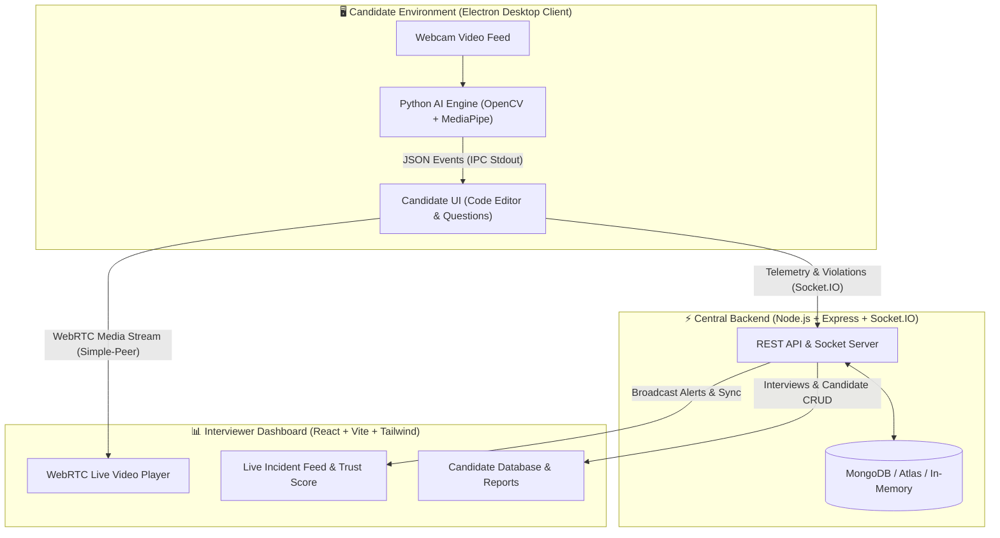

<div align="center">

# 🛡️ ProctorAI Enterprise
### Next-Generation AI-Powered Remote Proctoring & Technical Interview Platform

[](https://github.com/sayeemraza234/ai-proctoring-system/stargazers)
[](https://github.com/sayeemraza234/ai-proctoring-system/network/members)
[](https://opensource.org/licenses/MIT)
[](https://nodejs.org)
[](https://python.org)
[](https://www.electronjs.org/)
[](https://reactjs.org/)

<p align="center">
  <b>Real-Time Gaze Tracking</b> • <b>Multi-Face Detection</b> • <b>Zero-Lag WebRTC Video Feeds</b> • <b>Dynamic Trust Scoring</b> • <b>Candidate Desktop Lockdown</b>
</p>

[Explore Features](#-key-features) • [System Architecture](#-system-architecture) • [Quick Start](#-quick-start) • [Tech Stack](#-technology-stack) • [Detection Matrix](#-detection-matrix)

---

</div>

## 📖 Overview

**ProctorAI** is a robust, end-to-end intelligent proctoring and assessment platform engineered to uphold academic and technical interview integrity. By blending **MediaPipe computer vision**, an **Electron desktop client**, and a **real-time React interviewer command center**, ProctorAI automatically detects suspicious candidate behavior, streams audio/video with low latency, and computes real-time candidate credibility scores.

Whether deployed for remote hiring or proctored university examinations, ProctorAI provides continuous behavioral monitoring without requiring human proctors to review hours of recorded video manually.

---

## 🌟 Key Features

<table>
  <tr>
    <td width="50%">
      <h3 align="center">👁️ AI Vision & Proctoring Engine</h3>
      <ul>
        <li><b>Absence & Multi-Person Detection:</b> Instant alert when the candidate leaves the camera frame or when an unauthorized person appears.</li>
        <li><b>3D Head Pose & Gaze Tracking:</b> Real-time iris and facial landmark tracking calculates pitch, yaw, and off-screen gaze directions.</li>
        <li><b>Resilient Dual Engine:</b> Runs OpenCV/MediaPipe natively; gracefully falls back to mock emulation if hardware or dependencies are unavailable.</li>
        <li><b>Frame Throttling:</b> Optimized landmark analysis at 5-frame intervals to minimize CPU/GPU load on standard laptops.</li>
      </ul>
    </td>
    <td width="50%">
      <h3 align="center">🖥️ Secure Electron Candidate Client</h3>
      <ul>
        <li><b>Integrated IDE:</b> Built-in coding editor, question viewer, and submission interface.</li>
        <li><b>Sub-Process AI Bridge:</b> Spawns and supervises the Python AI engine via IPC pipelines.</li>
        <li><b>Focus & Tab-Switch Auditing:</b> Flags window minimization, application switching, and clipboard actions.</li>
        <li><b>Direct Telemetry Streaming:</b> Emits timestamped violation events to the backend via WebSocket.</li>
      </ul>
    </td>
  </tr>
  <tr>
    <td width="50%">
      <h3 align="center">📊 Interviewer Command Dashboard</h3>
      <ul>
        <li><b>WebRTC Live Video:</b> Real-time peer-to-peer audio and webcam stream of the candidate.</li>
        <li><b>Dynamic Trust Scoring (1-100):</b> Real-time score penalty algorithm decaying candidate trust based on incident severity.</li>
        <li><b>Incident Log Timeline:</b> Filterable log stream of all events with confidence metrics.</li>
        <li><b>Comprehensive Reports:</b> Detailed PDF/summary generator with verdict options (Hire, Reject, Hold).</li>
      </ul>
    </td>
    <td width="50%">
      <h3 align="center">⚡ High-Performance Backend</h3>
      <ul>
        <li><b>Universal Database Adapter:</b> Auto-detects MongoDB Atlas, local MongoDB, or falls back to an embedded in-memory database zero-config.</li>
        <li><b>Bi-Directional Socket.IO:</b> Low-latency signaling, live alerts broadcast, and chat.</li>
        <li><b>RESTful Candidate API:</b> Full CRUD for candidates, questions, tests, logs, and interview session histories.</li>
      </ul>
    </td>
  </tr>
</table>

---

## 🏗️ System Architecture



---

## 🔍 Detection Matrix

| Event Code | Event Description | Default Severity | Score Penalty | Action Triggered |
| :--- | :--- | :---: | :---: | :--- |
| `no_face` | Candidate face left camera frame | **High** | `-15 pts` | Visual Warning + Timer alert |
| `multiple_faces` | Additional person detected in view | **High** | `-20 pts` | Instant high-priority flag |
| `off_screen_gaze` | Candidate looking away from screen | **Medium** | `-5 pts` | Gaze deviation log entry |
| `app_unfocused` | Window focus lost / Alt+Tab | **Medium** | `-10 pts` | Focus lost notification |
| `clipboard_paste` | External text copied/pasted | **Low** | `-2 pts` | Audit trail record |

---

## 🛠️ Technology Stack

| Layer | Technologies |
| :--- | :--- |
| **Candidate Desktop App** | Electron, HTML5, CSS3, JavaScript (ES6+), WebRTC, Simple-Peer |
| **Vision & AI Engine** | Python 3.9+, OpenCV (`cv2`), Google MediaPipe (Face Mesh & Detection) |
| **Interviewer Dashboard** | React 18, Vite, Tailwind CSS, Lucide React, Socket.IO Client |
| **Backend & Real-Time** | Node.js, Express.js, Socket.IO, HTTP, CORS |
| **Database & ORM** | MongoDB, Mongoose, `mongodb-memory-server` (Zero-config fallback) |
| **DevOps & Automation** | PowerShell 7, Windows Batch Scripts, Git |

---

## 📂 Repository Structure

```plaintext
ai-proctoring-system/
├── backend/                         # Node.js Express & Socket.IO backend
│   ├── models.js                    # Mongoose schemas (User, Interview, Log, Question)
│   ├── mongoStart.js                # Auto-configuring MongoDB connection helper
│   ├── server.js                    # Express server, Socket.IO signaling, REST routes
│   └── package.json
│
├── electron-client/                 # Electron Desktop Application
│   ├── ai-engine/                   # AI Computer Vision Subsystem
│   │   ├── proctor.py               # MediaPipe face & gaze tracker script
│   │   └── requirements.txt         # Python dependencies (opencv-python, mediapipe)
│   ├── main.js                      # Electron main process & IPC coordinator
│   ├── preload.js                   # Secure context bridge
│   └── src/
│       ├── index.html               # Candidate exam interface
│       ├── renderer.js              # WebRTC, editor logic, proctor event handling
│       └── style.css                # Candidate application styling
│
├── interviewer-dashboard/           # Modern React + Vite Dashboard
│   ├── src/
│   │   ├── components/
│   │   │   ├── AlertsPanel.jsx      # Real-time incident logs & severity badges
│   │   │   ├── DatabaseViewer.jsx   # Candidate management & test histories
│   │   │   ├── LiveStream.jsx       # Low-latency WebRTC candidate video stream
│   │   │   └── ReportView.jsx       # Candidate performance & integrity evaluation
│   │   ├── App.jsx                  # Main dashboard controller & state manager
│   │   └── index.css                # Custom theme & Tailwind directives
│   └── vite.config.js
│
├── .gitignore                       # Clean repository ignore configuration
├── start-all.ps1                    # Unified enterprise launch script
├── stop.ps1                         # Graceful teardown script
├── START ProctorAI.bat              # One-click Windows desktop launcher
├── STOP ProctorAI.bat               # One-click Windows desktop stopper
├── sync.ps1                         # One-command GitHub sync & auto-commit
└── README.md                        # Documentation
```

---

## 🚀 Quick Start

### Prerequisites
- **Node.js** v18 or higher ([Download Node.js](https://nodejs.org/))
- **Python** 3.9+ *(Recommended for real MediaPipe AI detection)*
- **Git**

---

### Method 1: One-Click Launch (Windows)

Simply double-click the included batch launcher in the root directory:
```plaintext
▶️ START ProctorAI.bat
```
*Or execute the PowerShell orchestrator:*
```powershell
.\start-all.ps1
```
This script automatically:
1. Clears any stale processes on ports `5000` & `5173`.
2. Verifies Node.js and Python environments.
3. Automatically installs missing `npm` and `pip` dependencies.
4. Starts the **Backend Server** (`http://localhost:5000`).
5. Launches the **Interviewer Dashboard** (`http://localhost:5173`).
6. Opens the **Electron Candidate App**.

To terminate all services safely, run:
```plaintext
⏹️ STOP ProctorAI.bat
```

---

### Method 2: Manual Step-by-Step Setup

<details>
<summary><b>Click to expand manual setup instructions</b></summary>

#### 1. Setup Backend Server
```bash
cd backend
npm install
npm start
```
*The backend will boot on `http://localhost:5000` with automated database seeding.*

#### 2. Setup AI Vision Engine
```bash
cd electron-client/ai-engine
pip install -r requirements.txt
```

#### 3. Launch Candidate Electron App
```bash
cd electron-client
npm install
npm start
```

#### 4. Launch Interviewer Dashboard
```bash
cd interviewer-dashboard
npm install
npm run dev
```
*Visit `http://localhost:5173` in your web browser.*

</details>

---

## ⚙️ Environment Configuration

In the `backend/` directory, create a `.env` file (copied from `.env.example`):

```env
# Server Port
PORT=5000

# MongoDB URI (Leave empty to use auto in-memory database)
# Example Atlas: mongodb+srv://<user>:<password>@cluster.mongodb.net/proctorai
MONGO_URI=

# JWT Secret for authentication tokens
JWT_SECRET=your_super_secret_jwt_key
```

> **Note:** If no `MONGO_URI` is provided, the system seamlessly initializes an embedded `mongodb-memory-server` without any configuration required.

---

## 🔄 Instant GitHub Sync

This repository includes a convenient synchronization script [`sync.ps1`](./sync.ps1). To push your local updates to GitHub in one step:

```powershell
.\sync.ps1 "Your commit description here"
```

---

## 📄 License

Distributed under the **MIT License**. See `LICENSE` for details.

---

<div align="center">

Made with ❤️ by **[Sayeem Raza](https://github.com/sayeemraza234)**

[](https://github.com/sayeemraza234)

</div>
